# Understanding App.tsx - A Beginner's Guide

This document explains every part of the `App.tsx` file, the **entry point** of the Naqleen CMS React application.

---

## Visual Architecture - Step by Step

The app renders in a **top-to-bottom flow**. Each step depends on the previous one:

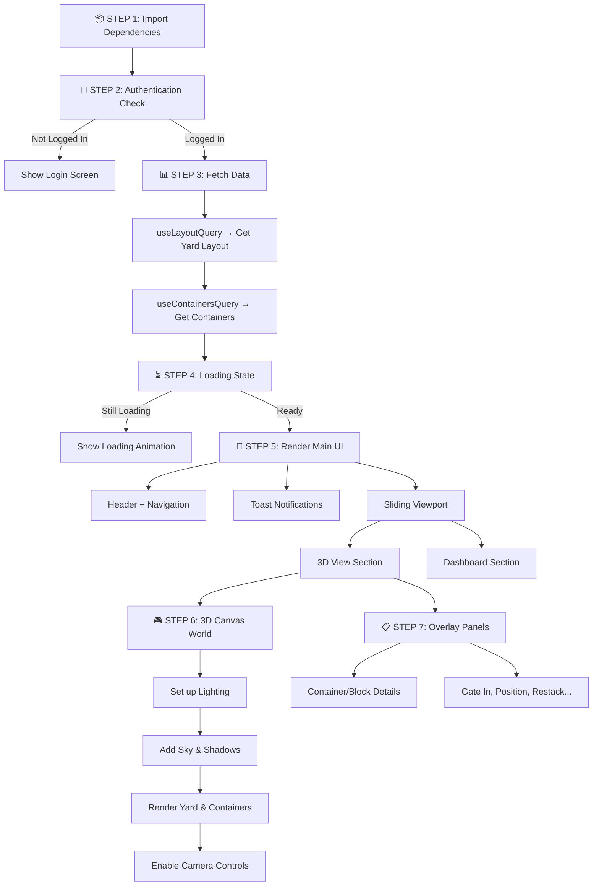

---

## What Happens at Each Step

### Step 1: Import Dependencies
```tsx
import { Canvas } from '@react-three/fiber';
import { useState, useEffect } from 'react';
import { useStore } from './store/store';
```
We import React, 3D libraries, and our custom components.

---

### Step 2: Authentication Check
```tsx
if (!isAuthenticated) {
  return <LoginScreen onLoginSuccess={() => setIsAuthenticated(true)} />;
}
```
**Early return pattern** - if not logged in, show login and stop here.

---

### Step 3: Fetch Data
```tsx
const { data: layout } = useLayoutQuery(selectedIcdId);
const { isLoading } = useContainersQuery(layout);
```
**React Query** fetches yard layout and containers from the API.

---

### Step 4: Loading State
```tsx
{showLoadingScreen && <LoadingScreen isLoading={isDataLoading} />}
```
Show animated loader until data is ready.

---

### Step 5: Render Main UI
```tsx
<ModernHeader activeNav={activeNav} onNavChange={handleNavChange} />
<ToastContainer />
```
Header with navigation + toast notifications.

---

### Step 6: 3D Canvas World

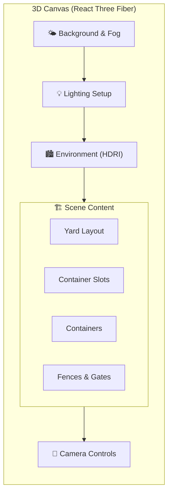

---

### Step 7: Overlay Panels

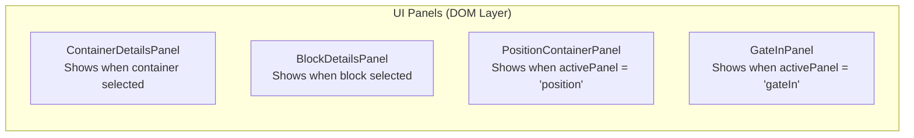

### 1. Imports (Lines 1-42)

```tsx
import * as THREE from 'three';
import { Canvas } from '@react-three/fiber';
import { useState, useEffect, useRef } from 'react';
```

**Concept: Imports**
React components are modular. We import:
- **THREE.js** - Core 3D library
- **@react-three/fiber** - React wrapper for Three.js
- **React Hooks** - `useState`, `useEffect`, `useRef`
- **Custom Components** - Our panels, UI elements, 3D objects

---

### 2. Component State (Lines 44-54)

```tsx
const App = () => {
  const [isAuthenticated, setIsAuthenticated] = useState(false);
  const [selectedIcdId, setSelectedIcdId] = useState('naqleen-jeddah');
  const [sceneReady, setSceneReady] = useState(false);
  const [activeNav, setActiveNav] = useState('3D View');
```

**Concept: useState Hook**

`useState` creates **reactive variables**. When they change, React re-renders the component.

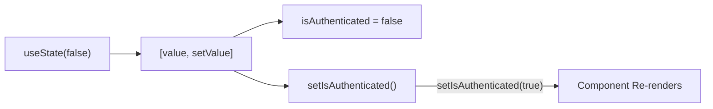

| State Variable | Purpose |
|---------------|---------|
| `isAuthenticated` | Controls login gate |
| `selectedIcdId` | Current terminal/yard ID |
| `sceneReady` | 3D scene loaded flag |
| `activeNav` | Current view (3D/Dashboard) |

---

### 3. Refs (Lines 52-54)

```tsx
const canvasSectionRef = useRef<HTMLElement>(null);
const controlsRef = useRef<any>(null);
```

**Concept: useRef Hook**

`useRef` creates a **persistent reference** to a DOM element or value that doesn't trigger re-renders when changed.

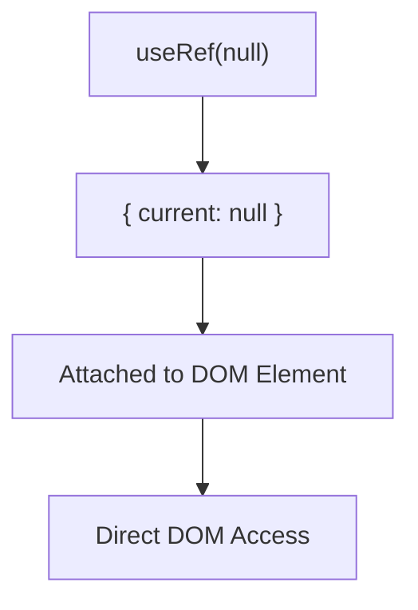

Here, `controlsRef` lets us directly control the 3D camera.

---

### 4. Data Fetching (Lines 47-48)

```tsx
const { data: layout, isLoading: layoutLoading } = useLayoutQuery(selectedIcdId);
const { isLoading: containersLoading } = useContainersQuery(layout || null);
```

**Concept: React Query**

React Query handles **server state** - data that lives on the server.

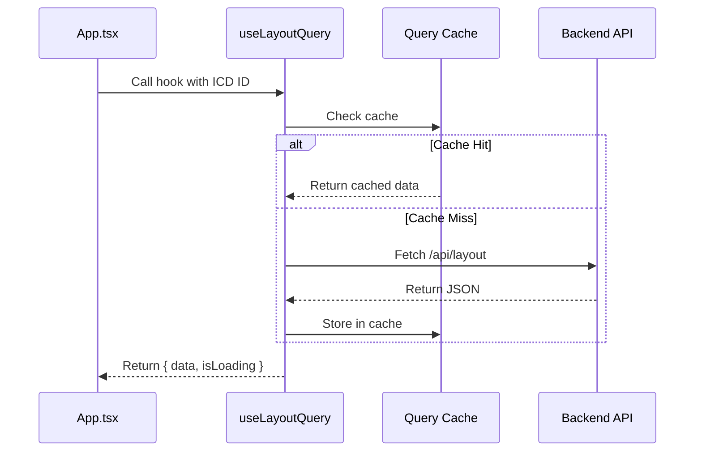

---

### 5. Zustand Store (Lines 88-95)

```tsx
const activePanel = useUIStore((state) => state.activePanel);
const selectId = useStore((state) => state.selectId);
const setSelectId = useStore((state) => state.setSelectId);
```

**Concept: Global State with Zustand**

Zustand is a lightweight state manager. It creates a **single source of truth** that any component can read/write.

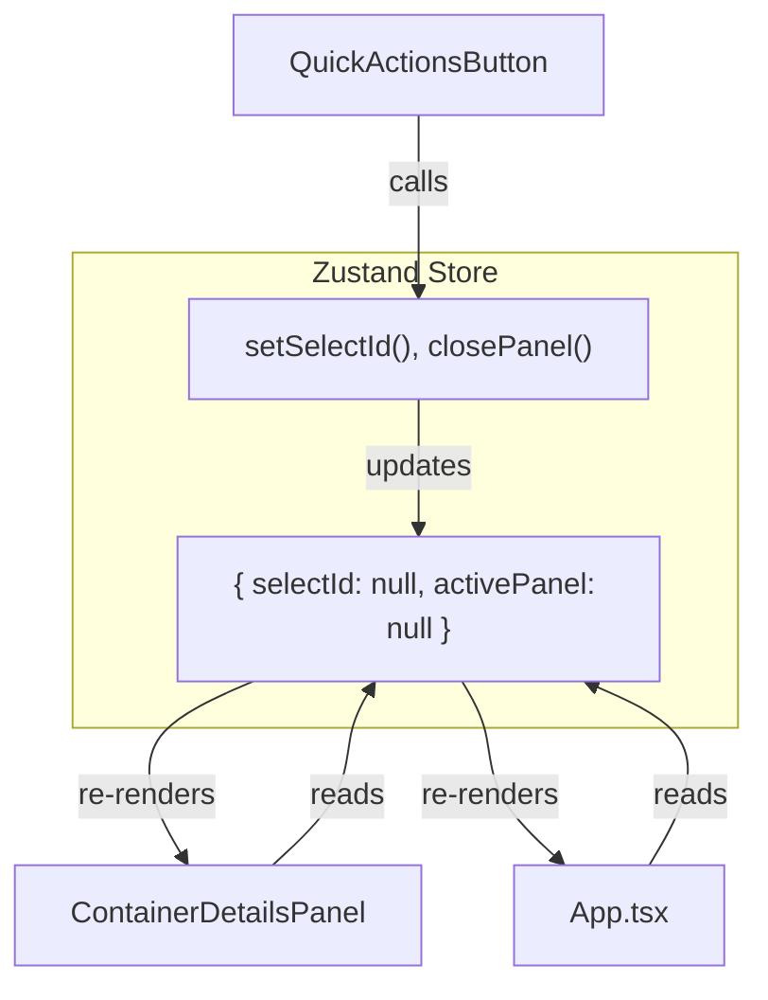

---

### 6. Side Effects (Lines 98-114)

```tsx
useEffect(() => {
  if (activePanel) {
    setSelectId(null);
    setSelectedBlock(null);
  }
}, [activePanel, setSelectId, setSelectedBlock]);
```

**Concept: useEffect Hook**

`useEffect` runs code **after render** in response to changes. It's for "side effects" like:
- Syncing state
- API calls
- Event listeners

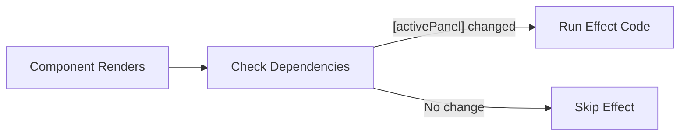

| Dependency Array | Behavior |
|-----------------|----------|
| `[]` | Run once on mount |
| `[activePanel]` | Run when activePanel changes |
| None | Run on every render (avoid!) |

---

### 7. Authentication Gate (Lines 116-118)

```tsx
if (!isAuthenticated) {
  return <LoginScreen onLoginSuccess={() => setIsAuthenticated(true)} />;
}
```

**Concept: Conditional Rendering**

React renders different UI based on conditions. This is an **early return pattern** - if not logged in, show login screen and stop.

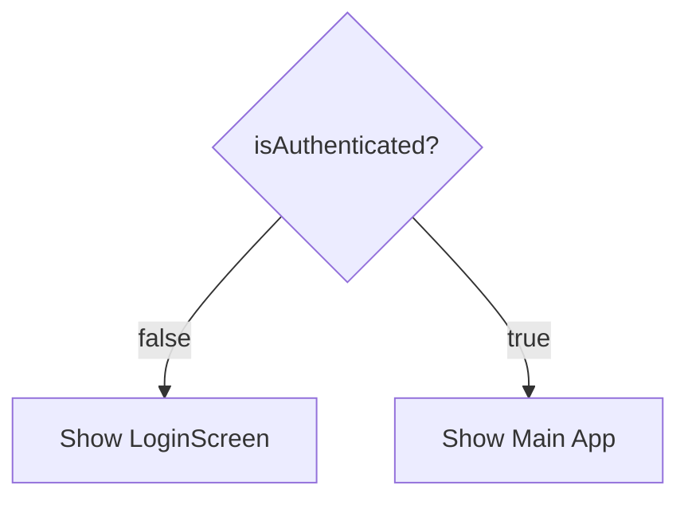

---

### 8. The Main Return (Lines 120-316)

The return statement is **JSX** - a syntax that looks like HTML but compiles to JavaScript.

#### Layout Structure

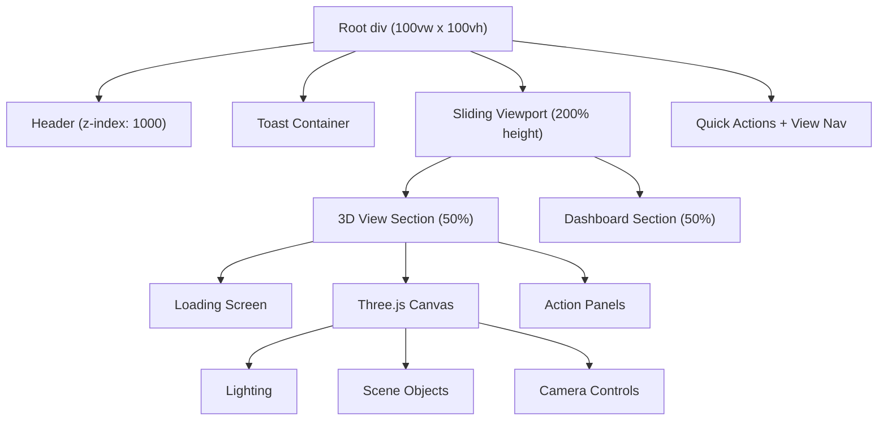

---

### 9. The 3D Canvas (Lines 182-265)

```tsx
<Canvas
  camera={{ position: [0, 150, 300], fov: 45 }}
  shadows
  dpr={[1, 1.5]}
>
```

**Concept: React Three Fiber Canvas**

The `<Canvas>` component creates a **WebGL rendering context** where all 3D content lives.

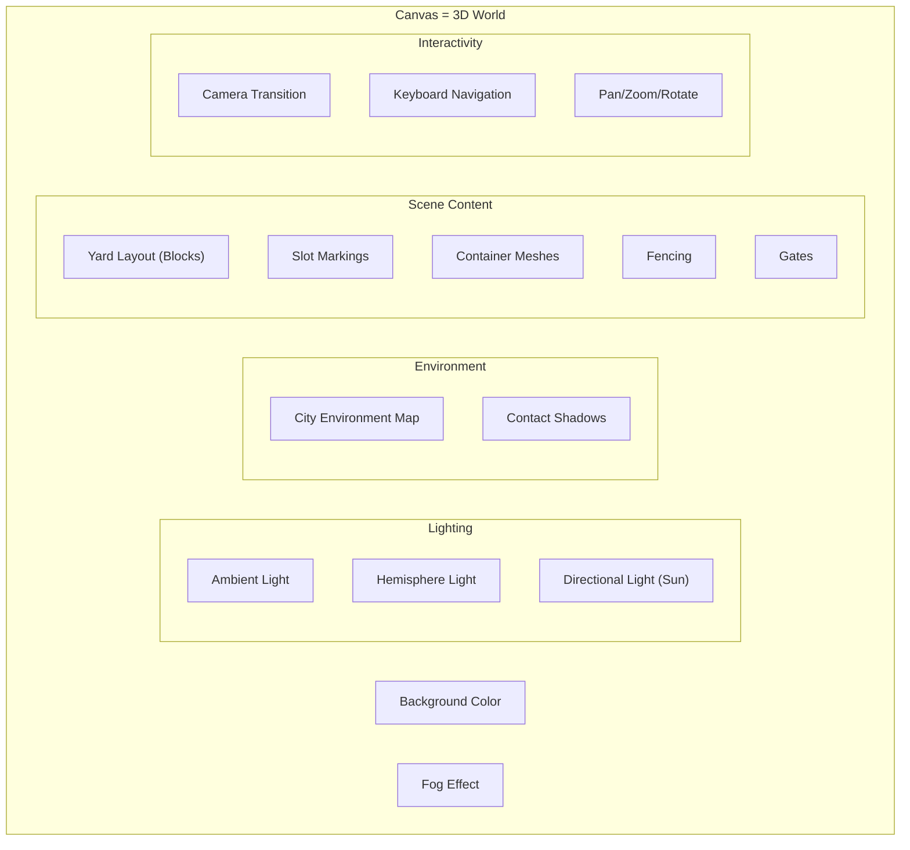

---

### 10. UI Panels (Lines 267-290)

```tsx
<ContainerDetailsPanel />
<PositionContainerPanel isOpen={activePanel === 'position'} onClose={closePanel} />
```

**Concept: Controlled vs Uncontrolled Panels**

- **ContainerDetailsPanel** - Self-managed (reads from store internally)
- **PositionContainerPanel** - Controlled via `isOpen` prop

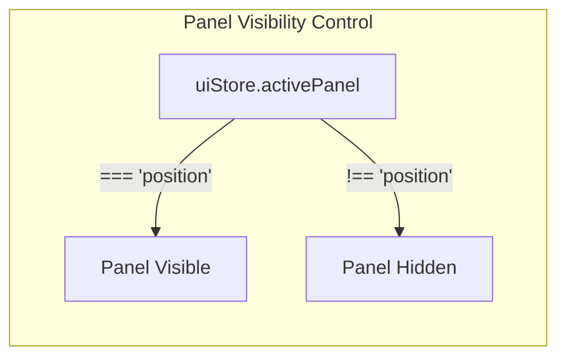

---

## Key React Concepts Summary

| Concept | What it does | Used for |
|---------|-------------|----------|
| `useState` | Create reactive state | User authentication, navigation |
| `useEffect` | Run side effects | Syncing panels, cleanup |
| `useRef` | Persist values without re-render | Camera controls, DOM refs |
| `useQuery` | Fetch & cache server data | Layout, containers |
| **Zustand** | Global state management | Selected container, active panel |
| **JSX** | Declarative UI syntax | Everything you see |
| **Props** | Pass data to children | `isOpen`, `onClose` |
| **Conditional Rendering** | Show/hide based on state | Login gate, loading screen |

---

## Data Flow Diagram

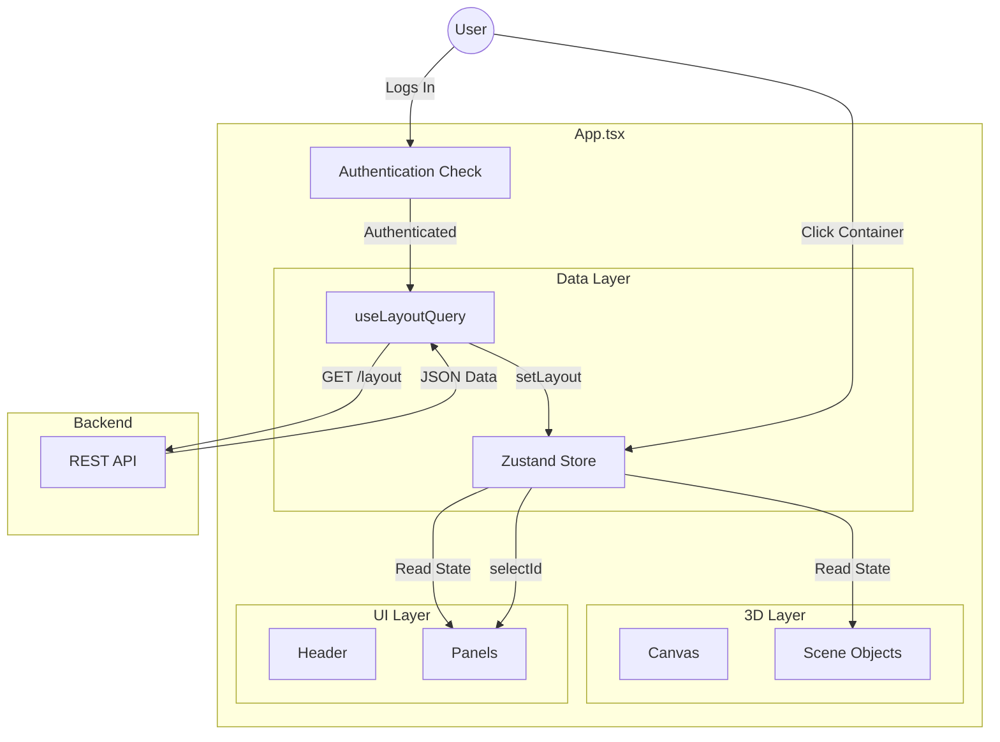

---

## Common Patterns Used

### 1. Early Return Pattern
```tsx
if (!isAuthenticated) return <LoginScreen />;
```
Stops execution early for guard conditions.

### 2. Controlled Component Pattern
```tsx
<Panel isOpen={condition} onClose={handler} />
```
Parent controls child's visibility.

### 3. Render Props / Children Pattern
```tsx
<EffectsWrapper>
  <LayoutEnvironment />
  <Containers />
</EffectsWrapper>
```
Wrapper adds effects to children.

### 4. Selector Pattern (Zustand)
```tsx
const selectId = useStore((state) => state.selectId);
```
Only re-render when this specific value changes.

---

## File Location

[App.tsx](file:///d:/Madhan_Projects/naqleen-cms-react/src/App.tsx)
