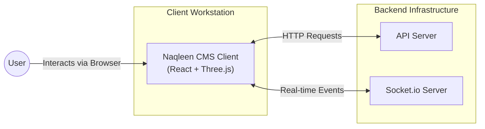
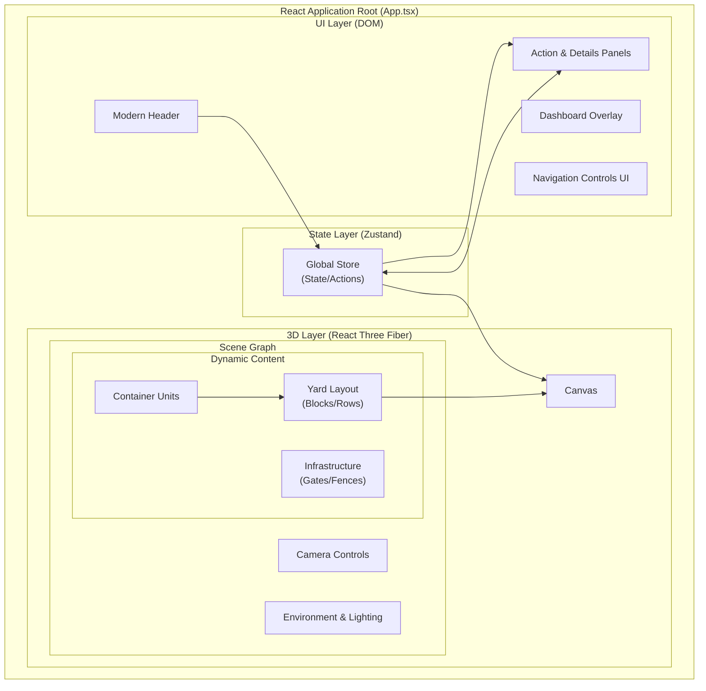
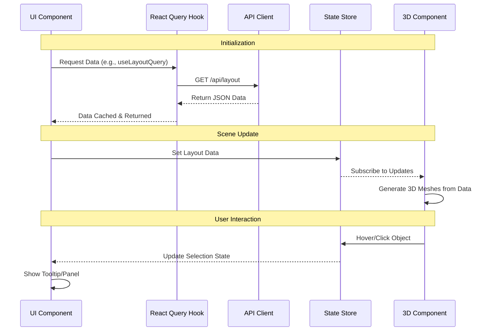

# Naqleen CMS Architecture Diagram

To ensure clarity, the architecture is broken down into three focused views: **System Context**, **Client Application Structure**, and **Data Flow**.

## 1. High-Level System Context

A simplified view of how the Client Application interacts with external systems.

---

## 2. Core Client Application Structure

Focuses on the internal organization of the React application, specifically the bridge between the UI (DOM) and the 3D Scene (Canvas).

---

## 3. Data Flow & State Management

Illustrates how data is fetched, cached, and propagated to the 3D scene.

